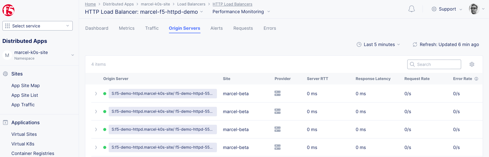
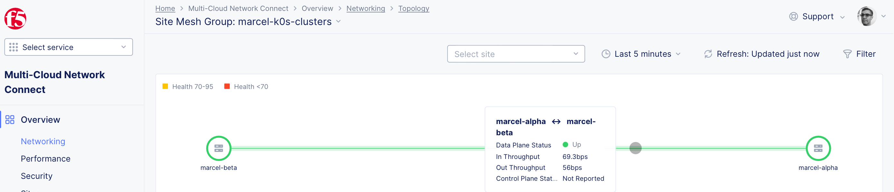

## f5-demo-httpd

Deploy f5-demo-httpd deployment with 4 replica (matching the number of nodes) on beta cluster, 
with http load balancer on alpha cluster:






```
$ k get services 

NAME            TYPE        CLUSTER-IP      EXTERNAL-IP   PORT(S)        AGE
f5-httpd-demo   NodePort    10.111.151.19   <none>        80:31702/TCP   61s
kubernetes      ClusterIP   10.96.0.1       <none>        443/TCP        3d5h

mwiget@u1:~/git/f5xc-k0s-site-proxmox/f5-demo-httpd$ curl -H Host:f5-httpd-demo http://192.168.40.98:31702/txt
================================================
 ___ ___   ___                    _
| __| __| |   \ ___ _ __  ___    /_\  _ __ _ __
| _||__ \ | |) / -_) '  \/ _ \  / _ \| '_ \ '_ \ 
|_| |___/ |___/\___|_|_|_\___/ /_/ \_\ .__/ .__/
                                      |_|  |_|
================================================

      Node Name: marcel-beta
     Short Name: f5-demo-httpd-555c7dd895-rwfrz

      Server IP: 10.244.2.37
    Server Port: 80

      Client IP: 10.244.1.33
    Client Port: 51209

Client Protocol: HTTP
 Request Method: GET
    Request URI: /txt

    host_header: f5-demo-httpd.marcel-k0s-site
     user-agent: curl/7.81.0
x-forwarded-for: 192.168.40.98
```

```
$ k get nodes -o wide

NAME       STATUS   ROLES    AGE    VERSION        INTERNAL-IP     EXTERNAL-IP   OS-IMAGE             KERNEL-VERSION      CONTAINER-RUNTIME
alpha-w0   Ready    <none>   3d5h   v1.23.15+k0s   192.168.40.13   <none>        Ubuntu 22.04.2 LTS   5.15.0-78-generic   containerd://1.5.16
alpha-w1   Ready    <none>   3d5h   v1.23.15+k0s   192.168.40.98   <none>        Ubuntu 22.04.2 LTS   5.15.0-78-generic   containerd://1.5.16
alpha-w2   Ready    <none>   3d5h   v1.23.15+k0s   192.168.40.18   <none>        Ubuntu 22.04.2 LTS   5.15.0-78-generic   containerd://1.5.16
alpha-w3   Ready    <none>   2d7h   v1.23.15+k0s   192.168.40.90   <none>        Ubuntu 22.04.2 LTS   5.15.0-78-generic   containerd://1.5.16
```
